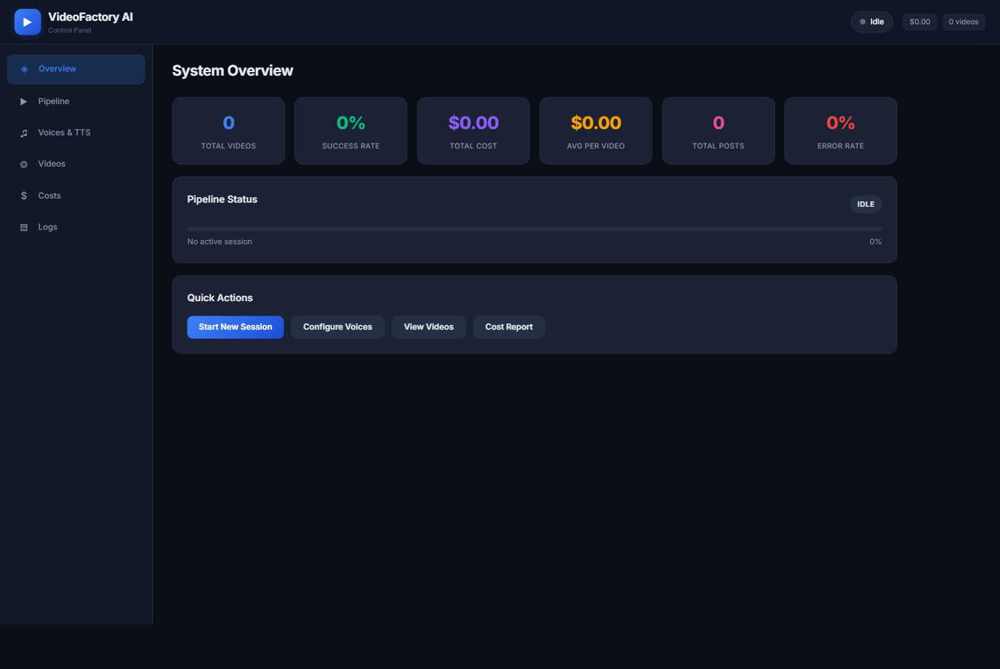

# VideoFactory - Automated AI Video Generation

> End-to-end pipeline turning a topic into a finished short video and publishing it to social channels.

Built by **[Muhammad Tanveer](https://www.linkedin.com/in/muhammad-tanveer-advenno/)** - Full-Stack AI Automation Engineer.

[](#source-code-and-access) [](https://github.com/haddindeve)

## Contents

- [The problem](#the-problem)
- [The approach](#the-approach)
- [Architecture](#architecture)
- [Tech stack](#tech-stack)
- [Key capabilities](#key-capabilities)
- [Selected code](#selected-code)
- [Screenshots](#screenshots)
- [Results](#results)
- [FAQ](#faq)
- [Source code and access](#source-code-and-access)
- [About the engineer](#about-the-engineer)
- [Related projects](#related-projects)

## The problem

Short-form video demands constant output. Producing each clip by hand - script, voiceover, footage, edit, caption, upload - takes hours, and consistency drops as volume rises.

## The approach

A staged pipeline where each step is a separate engine: script generation, narration, clip sourcing, assembly and publishing. Because the stages are separate, any one can be swapped or rerun without redoing the whole video, and the whole chain can run unattended.

## Architecture

| Component | Responsibility |
| --- | --- |
| **Script engine** | Topic to structured script |
| **Narration** | Voice synthesis |
| **Clip sourcing** | Footage retrieval and selection |
| **Assembly** | Composition, captioning and render |
| **Publishing** | Direct posting to social channels |

## Tech stack

| Layer | Technology |
| --- | --- |
| Language | Python |
| Generation | LLM scripting and voice synthesis |
| Media | Programmatic video assembly |
| Distribution | Social platform publishing |

## Key capabilities

- Topic-to-video generation
- Automated narration
- Clip sourcing and assembly
- Caption generation
- Scheduled publishing to social channels

## Selected code

From `engines/clip_downloader.py` in the private repository:

```python
"""
VideoFactory AI - Video Clip Downloader
Module 10: Downloads movie clips using YT-DLP.

FIXED:
- yt-dlp search format corrected (ytsearch1: prefix)
- Proper portrait crop filter applied to landscape clips
- Duration limits added (max 3 min per clip to avoid full movie downloads)
- Cookie/auth workaround for age-restricted content
- Better search query building per niche
- Fallback to multiple search strategies
- File existence check after download
- ffprobe used to verify downloaded clip integrity
"""

import os
import json
import logging
```

## Screenshots



## Results

- Video production reduced from hours of manual editing to an unattended pipeline run
- Individual stages rerunnable without regenerating the whole video

## FAQ

### What does the pipeline produce?

Short-form video with generated script, narration, sourced footage and captions, ready to publish.

### Can stages be replaced?

Yes - each stage is a separate engine, so voice or footage sourcing can be swapped without touching the rest.

### Does it publish automatically?

Publishing to social channels is part of the chain and can run unattended.

### Is the code available?

Private repository; access on request.

## Source code and access

This repository is the public case study for **VideoFactory - Automated AI Video Generation**. The full implementation - application code, database schema, tests and deployment configuration - lives in a **private repository** on this account, alongside the rest of the work shown here.

Source access can be arranged for hiring conversations, technical review or client due diligence. The quickest route is a short message on [LinkedIn](https://www.linkedin.com/in/muhammad-tanveer-advenno/) or an email to [mtanveertahir6666@gmail.com](mailto:mtanveertahir6666@gmail.com).

## About the engineer

**Muhammad Tanveer - Full-Stack AI Automation Engineer**

Full-stack AI automation engineer. I build agentic systems, browser and workflow automation, RAG pipelines and the production web platforms they run on - from Rust and Python services to Next.js dashboards and PHP/MySQL business systems.

- GitHub: [haddindeve](https://github.com/haddindeve)
- LinkedIn: [Muhammad Tanveer](https://www.linkedin.com/in/muhammad-tanveer-advenno/)
- Email: [mtanveertahir6666@gmail.com](mailto:mtanveertahir6666@gmail.com)
- Location: Pakistan

## Related projects

- [SpoofGuard - Face Anti-Spoofing and Liveness Detection](https://github.com/haddindeve/spoofguard-ai-face-anti-spoofing)
- [ARMenu - Augmented Reality Restaurant Menu SaaS](https://github.com/haddindeve/armenu-augmented-reality-menu-saas)
- [Doctern - AI Document OCR and Table Extraction](https://github.com/haddindeve/doctern-document-ocr-ai)
- [ACIP - AI Content Intelligence Platform](https://github.com/haddindeve/bloggen-ai-content-platform)
- [AI Sales Agent - Automated Lead Generation and Outreach](https://github.com/haddindeve/advenno-ai-sales-agent)
- [Local Pulse - Google Maps CTR Automation Platform](https://github.com/haddindeve/local-pulse-maps-ctr-platform)

---

<sub>VideoFactory - Automated AI Video Generation - case study by Muhammad Tanveer - Full-Stack AI Automation Engineer. Keywords: AI video generation, automated video pipeline, social media automation, faceless video automation, content automation, video publishing bot.</sub>